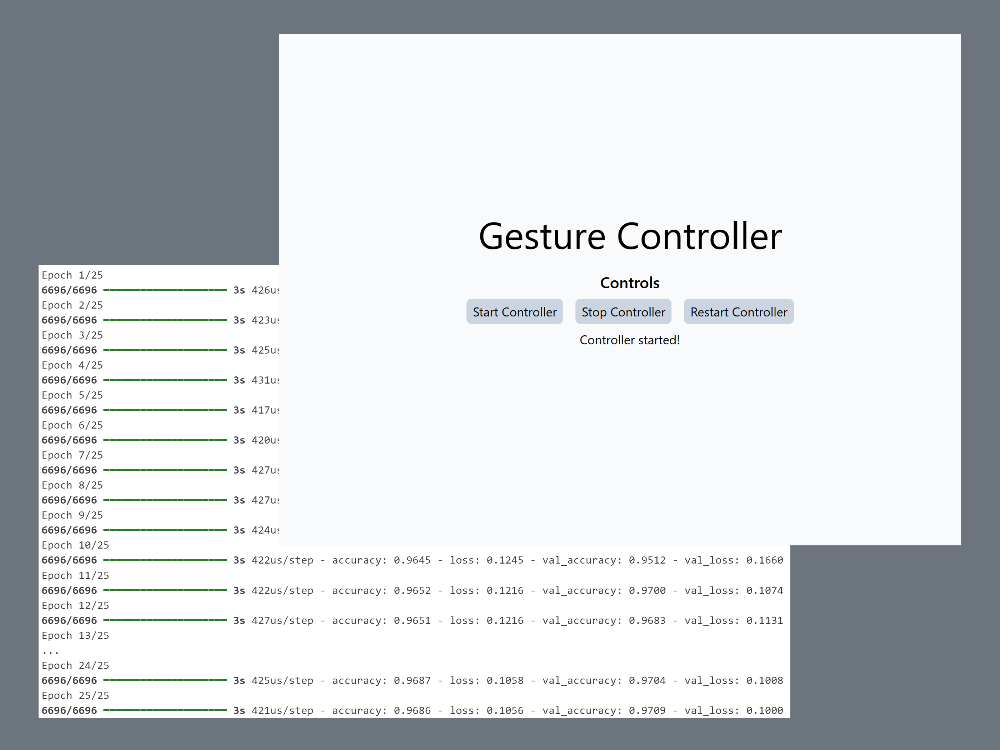

# Gesture Controller

<p align="center"></p>

A deep learning powered multimedia controller operated by hand gestures.

The application is built using Flask, Python, OpenCV, Mediapipe, and TailwindCSS, with a TensorFlow-trained model and data collected via Mediapipe.

## About

The model consists of two dense layers with ReLU activation, followed by a fully-connected dense layer with softmax activation. It uses the Adam optimizer and sparse categorical cross-entropy as the loss function. The model achieves a validation accuracy of 97%. 

Landmark data was collected from the [HaGRID (512px)](https://github.com/hukenovs/hagrid) dataset.

## Setup

1. **Clone the repository:**
    ```bash
    git clone https://github.com/siddhp1/Gesture-Controller.git
    cd Gesture-Controller/app
    ```

2. **Create environment and install dependencies:**

    ```bash
    python -m venv venv
    source venv/bin/activate
    pip install -r requirements.txt
    ```

## Usage

1. **Run application:**
    ```bash
    python -m main
    ```

2. **Open GUI:**

    Go to `http://localhost:5000` in your web browser.

## License

This project is licensed under the MIT License.
